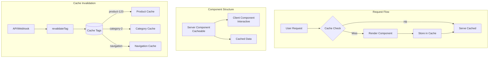
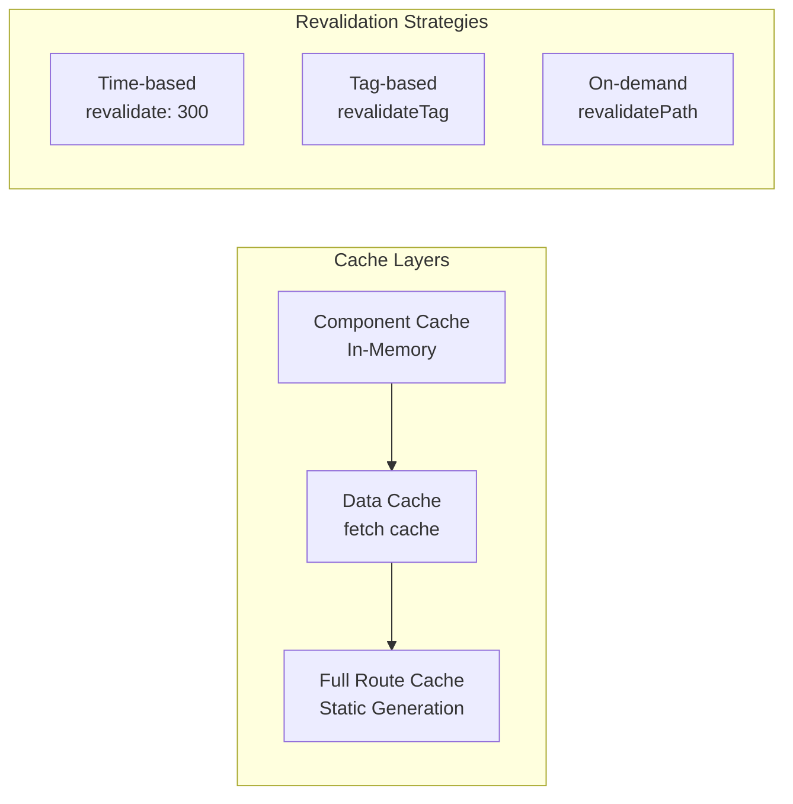
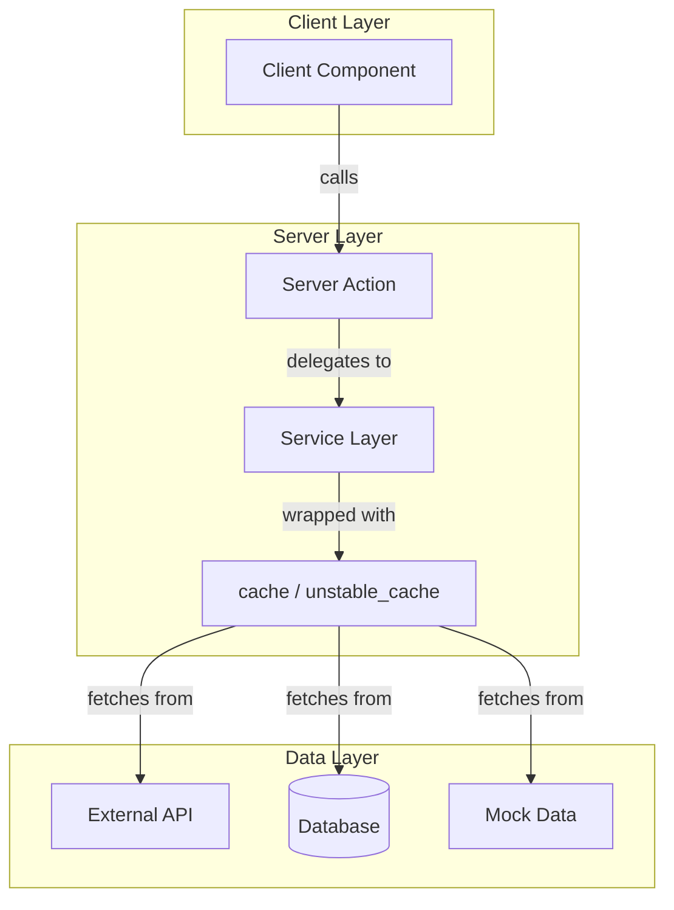
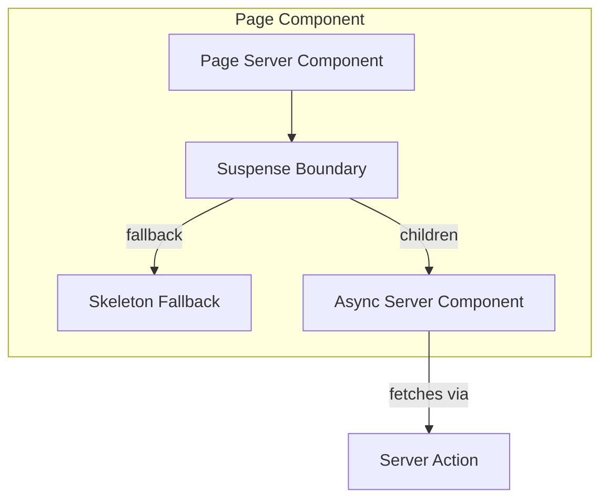
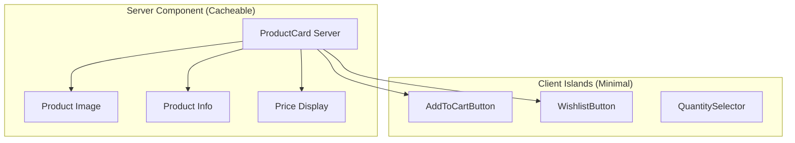

# Design Document: Cache Components Optimization

## Overview

Este documento descreve a arquitetura e implementação da otimização de cache de componentes para o e-commerce Mundial Megastore usando Next.js 16. O recurso `cacheComponents` já está habilitado no projeto (`next.config.ts`), mas os componentes precisam ser reestruturados para maximizar os benefícios do cache.

### Princípios Fundamentais

1. **Server-First**: Priorizar Server Components sempre que possível
2. **Client Islands Isolados**: Funcionalidades interativas são isoladas em componentes mínimos
3. **Server Actions + Services**: Nunca acessar dados diretamente - sempre via Server Actions que chamam Services
4. **Suspense + Skeletons**: Usar `<Suspense>` com Skeleton components para loading states
5. **Cache em Links e Fetch**: Utilizar `cache()` do React e `unstable_cache` do Next.js para dados
6. **Páginas Estáticas**: Componentes HTML são renderizados como páginas estáticas quando possível

## Architecture



### Cache Layer Architecture



### Data Flow Architecture (Server Actions + Services)



### Suspense + Skeleton Pattern



## Components and Interfaces

### Design Principle: Server-First with Isolated Client Islands

A abordagem prioriza **Server Components por padrão**. Client Components são usados apenas para funcionalidades que requerem interatividade do navegador (estado, eventos, hooks). Quando necessário, a funcionalidade de cliente é isolada em componentes mínimos ("islands") que são importados pelo Server Component pai.



### 1. Server Components (Cacheable - Priority)

#### ProductCard (Server Component)
```typescript
// src/components/product/ProductCard.tsx
// Server Component - renderiza todo conteúdo estático
// Client Components são importados apenas para ações interativas

interface ProductCardProps {
  product: {
    id: string;
    name: string;
    price: number;
    image: string;
    isNew?: boolean;
    discount?: number;
    category: string;
  };
}

// Server Component - cacheable, imports client islands for actions
export async function ProductCard({ product }: ProductCardProps): Promise<JSX.Element>
```

#### ProductGrid (Server Component)
```typescript
// src/components/product/ProductGrid.tsx
// Server Component com cache tags para invalidação granular

interface ProductGridProps {
  title: string;
  categoryId?: string;
  limit?: number;
}

// Server Component with cache tags - fetches and renders product list
export async function ProductGrid({ 
  title, 
  categoryId, 
  limit 
}: ProductGridProps): Promise<JSX.Element>
```

#### DepartmentNavigation (Server Component)
```typescript
// src/components/navigation/DepartmentNavigation.tsx
// Server Component - cached for 1 hour
// Renderiza navegação de categorias sem estado de cliente

export async function DepartmentNavigation(): Promise<JSX.Element>
```

#### MainHeader (Server Component)
```typescript
// src/components/header/MainHeader.tsx
// Server Component - estrutura estática do header
// Importa UserActions como Client Island para funcionalidades de usuário

export async function MainHeader(): Promise<JSX.Element>
```

#### HeroBanner (Server Component)
```typescript
// src/components/banner/HeroBanner.tsx
// Server Component - renderiza slides estáticos
// Importa BannerCarousel como Client Island para navegação

interface HeroBannerProps {
  slides: Slide[];
}

export async function HeroBanner({ slides }: HeroBannerProps): Promise<JSX.Element>
```

#### Footer (Server Component)
```typescript
// src/components/footer/Footer.tsx
// Server Component - cached for 24 hours
// Conteúdo completamente estático

export async function Footer(): Promise<JSX.Element>
```

### 2. Client Islands (Isolated Interactive Components)

Estes componentes são **mínimos** e contêm apenas a lógica de interatividade necessária.

#### AddToCartButton
```typescript
// src/components/product/actions/AddToCartButton.tsx
"use client"

interface AddToCartButtonProps {
  productId: string;
  productName: string;
  price: number;
}

// Minimal client component - only handles cart interaction
export function AddToCartButton({ productId, productName, price }: AddToCartButtonProps): JSX.Element
```

#### WishlistButton
```typescript
// src/components/product/actions/WishlistButton.tsx
"use client"

interface WishlistButtonProps {
  productId: string;
}

// Minimal client component - only handles wishlist toggle
export function WishlistButton({ productId }: WishlistButtonProps): JSX.Element
```

#### BannerCarousel
```typescript
// src/components/banner/BannerCarousel.tsx
"use client"

interface BannerCarouselProps {
  totalSlides: number;
  children: React.ReactNode;
}

// Client wrapper for carousel navigation - children are server-rendered slides
export function BannerCarousel({ totalSlides, children }: BannerCarouselProps): JSX.Element
```

#### UserActions
```typescript
// src/components/header/UserActions.tsx
"use client"

// Minimal client component for user-specific header actions
// Cart count, user menu, authentication state
export function UserActions(): JSX.Element
```

#### LoadMoreProducts
```typescript
// src/components/product/LoadMoreProducts.tsx
"use client"

interface LoadMoreProductsProps {
  categoryId: string;
  initialCount: number;
  totalCount: number;
}

// Client component for pagination - fetches more products on demand
export function LoadMoreProducts({ categoryId, initialCount, totalCount }: LoadMoreProductsProps): JSX.Element
```

### 3. Skeleton Components (Suspense Fallbacks)

```typescript
// src/components/skeletons/ProductCardSkeleton.tsx
export function ProductCardSkeleton(): JSX.Element {
  return (
    <div className="animate-pulse bg-card border border-border rounded-lg overflow-hidden">
      <div className="aspect-square bg-muted" />
      <div className="p-4 space-y-3">
        <div className="h-3 bg-muted rounded w-1/4" />
        <div className="h-4 bg-muted rounded w-3/4" />
        <div className="h-6 bg-muted rounded w-1/2" />
        <div className="h-10 bg-muted rounded" />
      </div>
    </div>
  );
}

// src/components/skeletons/ProductGridSkeleton.tsx
export function ProductGridSkeleton({ count = 8 }: { count?: number }): JSX.Element

// src/components/skeletons/NavigationSkeleton.tsx
export function NavigationSkeleton(): JSX.Element

// src/components/skeletons/HeroBannerSkeleton.tsx
export function HeroBannerSkeleton(): JSX.Element

// src/components/skeletons/ProductDetailSkeleton.tsx
export function ProductDetailSkeleton(): JSX.Element
```

### 4. Server Actions (Data Access Layer)

**Regra**: Componentes NUNCA acessam dados diretamente. Sempre via Server Actions.

```typescript
// src/app/actions/product.ts
"use server"

import { productService } from '@/services/product';

// Server Action para buscar produtos - usa service layer
export async function fetchProductsAction(categoryId?: string): Promise<Product[]> {
  return productService.getCachedProducts(categoryId);
}

// Server Action para buscar produto por slug
export async function fetchProductBySlugAction(slug: string[]): Promise<Product | null> {
  return productService.getCachedProductBySlug(slug);
}

// Server Action para buscar categorias
export async function fetchCategoriesAction(): Promise<Category[]> {
  return productService.getCachedCategories();
}

// Server Action para buscar produtos relacionados
export async function fetchRelatedProductsAction(
  productId: string, 
  categoryId: string
): Promise<Product[]> {
  return productService.getCachedRelatedProducts(productId, categoryId);
}
```

```typescript
// src/app/actions/cache.ts
"use server"

import { revalidateTag } from 'next/cache';
import { CACHE_TAGS } from '@/lib/cache-config';

export async function revalidateProductAction(productId: string): Promise<void> {
  revalidateTag(CACHE_TAGS.product(productId));
  revalidateTag(CACHE_TAGS.products);
}

export async function revalidateCategoryAction(categoryId: string): Promise<void> {
  revalidateTag(CACHE_TAGS.category(categoryId));
  revalidateTag(CACHE_TAGS.categories);
}

export async function revalidateNavigationAction(): Promise<void> {
  revalidateTag(CACHE_TAGS.navigation);
  revalidateTag(CACHE_TAGS.categories);
}
```

### 5. Service Layer with Cache

```typescript
// src/services/product.ts
import { cache } from 'react';
import { unstable_cache } from 'next/cache';
import { CACHE_TAGS, CACHE_DURATIONS } from '@/lib/cache-config';

// React cache() para deduplicação de requests na mesma renderização
export const getProducts = cache(async (categoryId?: string): Promise<Product[]> => {
  // Implementação que busca dados
});

// unstable_cache para cache persistente com tags
export const getCachedProducts = unstable_cache(
  async (categoryId?: string) => getProducts(categoryId),
  ['products'],
  {
    tags: [CACHE_TAGS.products],
    revalidate: CACHE_DURATIONS.products,
  }
);

export const getCachedProduct = unstable_cache(
  async (id: string) => getProductById(id),
  ['product'],
  {
    tags: [(id: string) => CACHE_TAGS.product(id)],
    revalidate: CACHE_DURATIONS.products,
  }
);

export const getCachedCategories = unstable_cache(
  async () => getCategories(),
  ['categories'],
  {
    tags: [CACHE_TAGS.categories, CACHE_TAGS.navigation],
    revalidate: CACHE_DURATIONS.navigation,
  }
);
```

### 6. Cache Configuration

```typescript
// src/lib/cache-config.ts
export const CACHE_TAGS = {
  product: (id: string) => `product-${id}`,
  category: (id: string) => `category-${id}`,
  products: 'products',
  categories: 'categories',
  navigation: 'navigation',
  banners: 'banners',
} as const;

export const CACHE_DURATIONS = {
  products: 300,      // 5 minutes
  navigation: 3600,   // 1 hour
  banners: 60,        // 1 minute
  footer: 86400,      // 24 hours
  default: 300,       // 5 minutes
} as const;

export type CacheTag = keyof typeof CACHE_TAGS | ReturnType<typeof CACHE_TAGS.product>;
```

### 7. Page Components with Suspense

```typescript
// src/app/(home)/page.tsx
import { Suspense } from 'react';
import { HeroBanner } from '@/components/banner/HeroBanner';
import { ProductGrid } from '@/components/product/ProductGrid';
import { DepartmentNavigation } from '@/components/navigation/DepartmentNavigation';
import { HeroBannerSkeleton } from '@/components/skeletons/HeroBannerSkeleton';
import { ProductGridSkeleton } from '@/components/skeletons/ProductGridSkeleton';
import { NavigationSkeleton } from '@/components/skeletons/NavigationSkeleton';

// Static page shell - cached as static HTML
export default function HomePage() {
  return (
    <main>
      <Suspense fallback={<HeroBannerSkeleton />}>
        <HeroBanner />
      </Suspense>
      
      <Suspense fallback={<NavigationSkeleton />}>
        <DepartmentNavigation />
      </Suspense>
      
      <Suspense fallback={<ProductGridSkeleton count={8} />}>
        <ProductGrid title="Produtos em Destaque" />
      </Suspense>
    </main>
  );
}
```

## Data Models

### Cache Entry Structure
```typescript
interface CacheEntry<T> {
  data: T;
  tags: string[];
  revalidate: number;
  timestamp: number;
}
```

### Cache Tag Registry
```typescript
interface CacheTagRegistry {
  'product-{id}': ProductCacheEntry;
  'category-{id}': CategoryCacheEntry;
  'products': ProductListCacheEntry;
  'categories': CategoryListCacheEntry;
  'navigation': NavigationCacheEntry;
  'banners': BannersCacheEntry;
}
```

### Component Cache Metadata
```typescript
interface ComponentCacheMetadata {
  componentName: string;
  cacheKey: string;
  tags: string[];
  duration: number;
  lastRevalidated?: Date;
}
```

### Skeleton Props Interface
```typescript
interface SkeletonProps {
  className?: string;
}

interface ProductGridSkeletonProps extends SkeletonProps {
  count?: number;
  columns?: 2 | 3 | 4;
}

interface ProductDetailSkeletonProps extends SkeletonProps {
  showRelated?: boolean;
}
```

## Correctness Properties

*A property is a characteristic or behavior that should hold true across all valid executions of a system-essentially, a formal statement about what the system should do. Properties serve as the bridge between human-readable specifications and machine-verifiable correctness guarantees.*

### Property 1: Cache Population on Static Props
*For any* product data with static props (id, name, price, image), rendering the ProductCard component twice with the same props should result in the second render being served from cache.
**Validates: Requirements 1.3, 1.4**

### Property 2: Granular Cache Invalidation
*For any* product update, calling revalidateTag with the product's tag should invalidate only caches tagged with that product identifier, while caches for other products remain valid.
**Validates: Requirements 1.2, 4.3, 4.4**

### Property 3: Cache Tag Assignment
*For any* cached component (product or category), the cache entry should be tagged with the appropriate identifier following the pattern `product-{id}` or `category-{id}`.
**Validates: Requirements 4.1, 4.2**

### Property 4: Server-Client Cache Isolation
*For any* Server Component with nested Client Components, state changes in the Client Component should not invalidate the cached Server Component parent.
**Validates: Requirements 3.3, 3.4**

### Property 5: Navigation Cache Persistence
*For any* navigation component (header, department navigation), the rendered output should be cached and served for subsequent requests until the categories tag is revalidated.
**Validates: Requirements 5.1, 5.2, 5.4**

### Property 6: Default Cache Duration
*For any* component without explicit revalidation configuration, the cache duration should default to 300 seconds.
**Validates: Requirements 6.5**

### Property 7: Stale-While-Revalidate Behavior
*For any* expired cache entry, the system should serve stale content immediately while triggering background revalidation.
**Validates: Requirements 7.3**

### Property 8: Product Detail Cache Independence
*For any* product detail page, the ProductImageGallery cache should be independent from ProductInfo cache, allowing separate invalidation.
**Validates: Requirements 2.4**

### Property 9: Suspense Fallback Rendering
*For any* async Server Component wrapped in Suspense, the Skeleton fallback should render immediately while the async component loads data via Server Actions.
**Validates: Requirements 1.1, 2.1**

### Property 10: Server Action Data Isolation
*For any* data fetch operation, the data should be accessed exclusively through Server Actions that delegate to the Service layer, never directly from components.
**Validates: Requirements 1.3, 2.2, 4.1**

## Error Handling

### Suspense Error Boundaries
```typescript
// src/components/error/AsyncErrorBoundary.tsx
"use client"

import { Component, ReactNode } from 'react';

interface Props {
  children: ReactNode;
  fallback: ReactNode;
}

export class AsyncErrorBoundary extends Component<Props, { hasError: boolean }> {
  state = { hasError: false };
  
  static getDerivedStateFromError() {
    return { hasError: true };
  }
  
  render() {
    if (this.state.hasError) {
      return this.props.fallback;
    }
    return this.props.children;
  }
}
```

### Server Action Error Handling
```typescript
// src/app/actions/product.ts
"use server"

export async function fetchProductsAction(categoryId?: string): Promise<Product[]> {
  try {
    return await productService.getCachedProducts(categoryId);
  } catch (error) {
    console.error('Failed to fetch products:', error);
    return []; // Return empty array as fallback
  }
}
```

### Revalidation Error Handling
```typescript
// src/app/actions/cache.ts
"use server"

export async function safeRevalidateTag(tag: string): Promise<{ success: boolean; error?: string }> {
  try {
    revalidateTag(tag);
    return { success: true };
  } catch (error) {
    console.error(`Failed to revalidate tag ${tag}:`, error);
    return { success: false, error: String(error) };
  }
}
```

### Fallback Strategies
1. **Suspense Fallback**: Skeleton components são exibidos durante carregamento
2. **Error Boundary**: Componente de erro é exibido se async component falhar
3. **Empty State**: Server Actions retornam arrays vazios em caso de erro
4. **Stale Content**: Cache serve conteúdo stale enquanto revalida em background

## Testing Strategy

### Dual Testing Approach

O projeto utilizará tanto testes unitários quanto testes baseados em propriedades para garantir cobertura completa.

### Unit Tests
- Verificar estrutura de componentes (Server vs Client)
- Testar configurações de cache específicas
- Validar cache tags são aplicadas corretamente
- Testar funções de revalidação

### Property-Based Tests

**Framework**: fast-check (biblioteca PBT para TypeScript/JavaScript)

Cada teste de propriedade deve:
1. Executar no mínimo 100 iterações
2. Ser anotado com referência à propriedade do design: `**Feature: cache-components-optimization, Property {number}: {property_text}**`
3. Gerar dados aleatórios representativos do domínio

```typescript
// Exemplo de estrutura de teste PBT
import fc from 'fast-check';

describe('Cache Components Properties', () => {
  // **Feature: cache-components-optimization, Property 1: Cache Population on Static Props**
  it('should cache component output for identical static props', () => {
    fc.assert(
      fc.property(
        fc.record({
          id: fc.uuid(),
          name: fc.string({ minLength: 1 }),
          price: fc.float({ min: 0.01, max: 99999 }),
          image: fc.webUrl(),
          category: fc.string({ minLength: 1 }),
        }),
        async (product) => {
          // Test implementation
        }
      ),
      { numRuns: 100 }
    );
  });
});
```

### Test Categories

1. **Cache Behavior Tests**
   - Cache hit/miss scenarios
   - Cache population timing
   - Stale-while-revalidate behavior

2. **Tag Invalidation Tests**
   - Single tag invalidation
   - Multiple tag invalidation
   - Cascade invalidation

3. **Component Structure Tests**
   - Server/Client component separation
   - Cache boundary integrity
   - Props serialization

4. **Integration Tests**
   - End-to-end cache flow
   - Revalidation API endpoints
   - Build-time static generation
