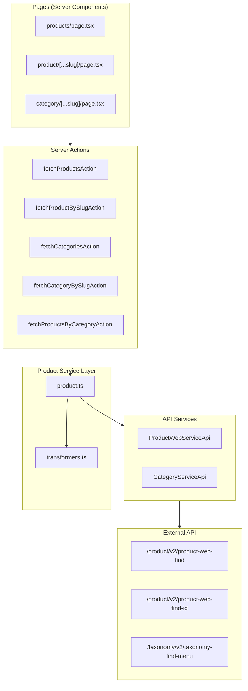

# Design Document

## Overview

Este documento descreve o design para migrar os dados mockados de produtos e categorias para dados reais obtidos via API REST. A solução envolve:

1. Criar funções de transformação para converter tipos da API (`ProductWebListItem`, `ProductWebDetail`, `TblTaxonomyWebMenu`) para os tipos esperados pelos componentes de UI
2. Atualizar o serviço `product.ts` para usar os serviços de API existentes
3. Manter a estratégia de cache existente com `cacheLife` e `cacheTag`
4. Preservar a interface das server actions para minimizar mudanças nos componentes

## Architecture



## Components and Interfaces

### 1. Data Transformers (`src/lib/transformers.ts`)

Novo módulo responsável por transformar dados da API para o formato esperado pela UI.

```typescript
// Tipos de entrada (API)
import type { ProductWebListItem, ProductWebDetail } from "@/services/api-main/product/types/product-types";
import type { TblTaxonomyWebMenu } from "@/services/api-main/category/types/category-types";

// Tipos de saída (UI)
export interface UIProduct {
  id: string;
  name: string;
  description: string | null;
  price: number;
  image: string;
  categoryId: string;
  subcategoryId?: string;
  inStock: boolean;
  brand: string | null;
  isNew?: boolean;
  discount?: number;
  specifications?: unknown;
  shipping?: unknown;
}

export interface UICategory {
  id: string;
  name: string;
  slug: string;
  href: string;
  iconName?: string;
  subcategories?: UISubcategory[];
}

export interface UISubcategory {
  id: string;
  name: string;
  slug: string;
  href: string;
}

// Funções de transformação
export function transformProductListItem(item: ProductWebListItem): UIProduct;
export function transformProductDetail(detail: ProductWebDetail): UIProduct;
export function transformCategoryMenu(menu: TblTaxonomyWebMenu[]): UICategory[];
export function findCategoryBySlug(
  categories: UICategory[],
  categorySlug: string,
  subcategorySlug?: string
): { category: UICategory; subcategory: UISubcategory | null } | null;
```

### 2. Updated Product Service (`src/services/product.ts`)

Atualização do serviço existente para usar as APIs reais.

```typescript
// Funções atualizadas
export async function getProducts(): Promise<UIProduct[]>;
export async function getProductById(id: string): Promise<UIProduct | undefined>;
export async function getProductBySlug(slug: string[]): Promise<UIProduct | undefined>;
export async function getCategories(): Promise<UICategory[]>;
export async function getCategoryBySlug(
  categorySlug: string,
  subcategorySlug?: string
): Promise<{ category: UICategory; subcategory: UISubcategory | null } | null>;
export async function getProductsByCategory(
  categoryId: string,
  subcategoryId?: string
): Promise<UIProduct[]>;
export async function getRelatedProducts(
  productId: string,
  taxonomyId: string
): Promise<UIProduct[]>;
```

### 3. Server Actions (`src/app/actions/product.ts`)

As server actions mantêm a mesma interface, apenas delegando para o serviço atualizado.

## Data Models

### Mapeamento de Campos - Produto

| API Field (ProductWebListItem) | UI Field (UIProduct) | Transformação |
|-------------------------------|---------------------|---------------|
| ID_PRODUTO | id | `String(ID_PRODUTO)` |
| PRODUTO | name | Direto |
| DESCRICAO_TAB | description | Direto (nullable) |
| VL_VAREJO | price | `parseFloat(VL_VAREJO)` |
| PATH_IMAGEM | image | Fallback para placeholder |
| ESTOQUE_LOJA | inStock | `ESTOQUE_LOJA > 0` |
| MARCA | brand | Direto (nullable) |
| LANCAMENTO | isNew | `LANCAMENTO === 1` |
| PROMOCAO | discount | Calcular se `PROMOCAO === 1` |

### Mapeamento de Campos - Categoria

| API Field (TblTaxonomyWebMenu) | UI Field (UICategory) | Transformação |
|------------------------------|----------------------|---------------|
| ID_TAXONOMY | id | `String(ID_TAXONOMY)` |
| TAXONOMIA | name | Direto |
| SLUG | slug | Direto |
| - | href | Gerar baseado na hierarquia |
| children | subcategories | Recursivo para níveis 2 e 3 |

### Hierarquia de Categorias

```
Nível 1 (Família)    → UICategory
  └── Nível 2 (Grupo)    → UISubcategory (em subcategories)
        └── Nível 3 (Subgrupo) → UISubcategory (em subcategories do grupo)
```

## Correctness Properties

*A property is a characteristic or behavior that should hold true across all valid executions of a system-essentially, a formal statement about what the system should do. Properties serve as the bridge between human-readable specifications and machine-verifiable correctness guarantees.*

### Property 1: Product list transformation completeness

*For any* valid `ProductWebListItem` from the API, the transformation function SHALL produce a `UIProduct` object where:
- `id` equals `String(ID_PRODUTO)`
- `name` equals `PRODUTO`
- `price` equals `parseFloat(VL_VAREJO)` and is a valid number
- `image` is a non-empty string (either `PATH_IMAGEM` or fallback)
- `inStock` equals `ESTOQUE_LOJA > 0`

**Validates: Requirements 1.2, 6.1, 6.3, 6.4**

### Property 2: Product detail transformation completeness

*For any* valid `ProductWebDetail` from the API, the transformation function SHALL produce a `UIProduct` object with all required fields populated following the same mapping rules as Property 1.

**Validates: Requirements 2.2**

### Property 3: Category transformation preserves hierarchy

*For any* valid `TblTaxonomyWebMenu[]` tree with N levels of nesting, the transformation function SHALL produce a `UICategory[]` array where:
- The number of top-level categories equals the number of level-1 items in input
- Each category's `subcategories` array contains all its children from the input
- The total count of categories across all levels is preserved

**Validates: Requirements 3.2, 3.3**

### Property 4: Slug resolution finds correct category with parent hierarchy

*For any* category tree and any slug that exists in the tree at any level, the `findCategoryBySlug` function SHALL:
- Return the matching category object
- If the slug is for a subcategory, return both the parent category and the subcategory
- Return `null` only when no category matches the slug

**Validates: Requirements 5.1, 5.2, 5.3**

### Property 5: Category href generation follows slug hierarchy pattern

*For any* category in the transformed output:
- Top-level category href SHALL equal `/category/{slug}`
- Subcategory href SHALL equal `/category/{parent-slug}/{slug}`

**Validates: Requirements 6.2**

## Error Handling

### API Errors

1. **Network/Connection Errors**: Catch and log, return empty array/undefined
2. **Not Found (404)**: Return undefined for products, null for categories
3. **Validation Errors**: Log with details, return empty/undefined

### Transformation Errors

1. **Missing Required Fields**: Use fallback values where possible
2. **Invalid Price Format**: Default to 0 and log warning
3. **Missing Image**: Use placeholder image path

### Error Response Pattern

```typescript
try {
  const response = await ProductWebServiceApi.findProducts(params);
  return transformProductList(ProductWebServiceApi.extractProductList(response));
} catch (error) {
  logger.error("Failed to fetch products:", error);
  return [];
}
```

## Testing Strategy

### Unit Testing

- Test individual transformer functions with various input shapes
- Test edge cases: empty arrays, null fields, invalid data
- Test error handling paths

### Property-Based Testing

Utilizaremos **fast-check** como biblioteca de property-based testing para TypeScript/JavaScript.

Cada property-based test DEVE:
1. Ser anotado com o formato: `**Feature: migrate-mock-to-api, Property {number}: {property_text}**`
2. Executar no mínimo 100 iterações
3. Usar geradores que produzam dados válidos conforme os tipos da API

#### Generators

```typescript
// Generator para ProductWebListItem
const productListItemArb = fc.record({
  ID_PRODUTO: fc.integer({ min: 1 }),
  SKU: fc.integer({ min: 1 }),
  PRODUTO: fc.string({ minLength: 1 }),
  DESCRICAO_TAB: fc.option(fc.string()),
  VL_VAREJO: fc.float({ min: 0 }).map(n => n.toFixed(2)),
  PATH_IMAGEM: fc.option(fc.string()),
  ESTOQUE_LOJA: fc.integer({ min: 0 }),
  MARCA: fc.option(fc.string()),
  LANCAMENTO: fc.integer({ min: 0, max: 1 }),
  PROMOCAO: fc.integer({ min: 0, max: 1 }),
  // ... outros campos
});

// Generator para TblTaxonomyWebMenu (hierárquico)
const categoryMenuArb = fc.letrec(tie => ({
  category: fc.record({
    ID_TAXONOMY: fc.integer({ min: 1 }),
    TAXONOMIA: fc.string({ minLength: 1 }),
    SLUG: fc.string({ minLength: 1 }).map(s => s.toLowerCase().replace(/\s/g, '-')),
    LEVEL: fc.integer({ min: 1, max: 3 }),
    children: fc.option(fc.array(tie('category'), { maxLength: 5 })),
  }),
})).category;
```

### Integration Testing

- Test full flow from server action to API call
- Test with real API responses (staging environment)
- Test cache behavior

