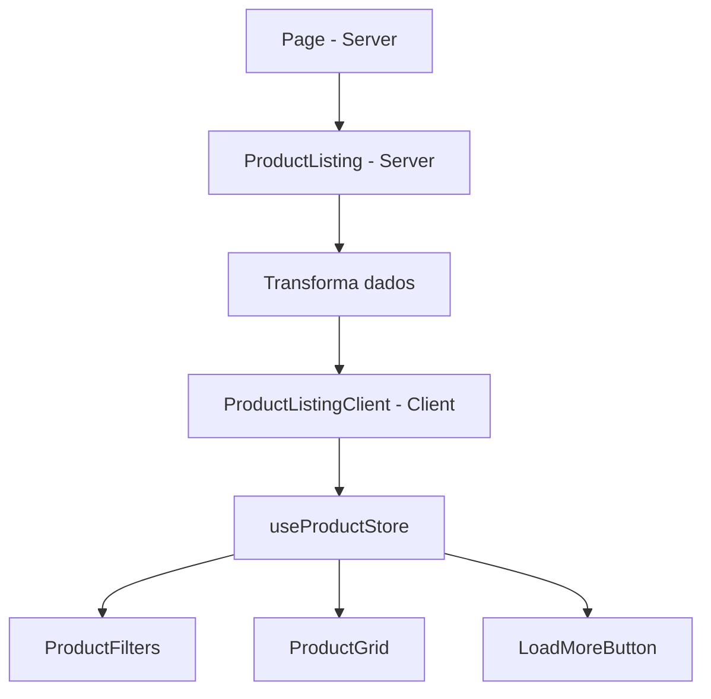

# Design Document

## Overview

Esta refatoração transforma o `ProductListing` de um Client Component monolítico em um Server Component que delega interatividade para componentes client filhos especializados. Isso segue o padrão recomendado pelo Next.js de "empurrar" componentes client para o final da árvore de componentes.

## Architecture

### Estrutura Atual (Antes)

```
ProductListing (Client) ─── "use client"
├── ProductFilters (Client)
├── ProductGrid (Server)
└── LoadMoreButton (Client)
```

### Estrutura Proposta (Depois)

```
ProductListing (Server) ─── sem "use client"
└── ProductListingClient (Client) ─── "use client"
    ├── ProductFilters (Client)
    ├── ProductGrid (Server)
    └── LoadMoreButton (Client)
```

### Fluxo de Dados



## Components and Interfaces

### ProductListing (Server Component)

Responsabilidades:
- Receber dados brutos de produtos e categorias
- Transformar dados (resolver nomes de categorias/subcategorias)
- Passar dados transformados para o componente client

```typescript
interface ProductListingProps {
  initialProducts: RawProduct[];
  categories: Category[];
}

// Dados transformados passados para o client
interface TransformedProduct {
  id: string;
  name: string;
  description: string;
  price: number;
  image: string;
  category: string;      // Nome resolvido
  subcategory: string;   // Nome resolvido
  inStock: boolean;
  brand?: string;
  discount?: number;
  isNew?: boolean;
}
```

### ProductListingClient (Client Component)

Novo componente em `src/app/(catalog)/products/_components/components/ProductListingClient.tsx`

Responsabilidades:
- Gerenciar estado via Zustand store
- Aplicar filtros nos dados transformados
- Controlar paginação
- Renderizar componentes filhos

```typescript
interface ProductListingClientProps {
  products: TransformedProduct[];
  categories: string[];           // Lista de nomes únicos
  categoryMap: CategoryMap;       // Mapa para lookup de subcategorias
}

interface CategoryMap {
  [categoryName: string]: string[];  // categoria -> subcategorias
}
```

## Data Models

### RawProduct (entrada do servidor)

```typescript
interface RawProduct {
  id: string;
  name: string;
  description: string;
  price: number;
  image: string;
  categoryId: string;      // ID
  subcategoryId: string;   // ID
  inStock: boolean;
  brand?: string;
  discount?: number;
  isNew?: boolean;
}
```

### TransformedProduct (saída para client)

```typescript
interface TransformedProduct {
  id: string;
  name: string;
  description: string;
  price: number;
  image: string;
  category: string;        // Nome resolvido
  subcategory: string;     // Nome resolvido
  categoryId: string;      // Mantido para filtragem
  subcategoryId: string;   // Mantido para filtragem
  inStock: boolean;
  brand?: string;
  discount?: number;
  isNew?: boolean;
}
```

## Correctness Properties

*A property is a characteristic or behavior that should hold true across all valid executions of a system-essentially, a formal statement about what the system should do. Properties serve as the bridge between human-readable specifications and machine-verifiable correctness guarantees.*

### Property 1: Transformação preserva todos os produtos

*For any* lista de produtos brutos, a transformação para produtos com nomes resolvidos deve preservar a mesma quantidade de produtos e todos os campos originais.

**Validates: Requirements 1.2**

### Property 2: Filtragem por categoria retorna subconjunto correto

*For any* lista de produtos e categoria selecionada, os produtos filtrados devem conter apenas produtos cuja categoria corresponde à selecionada, e o resultado deve ser um subconjunto da lista original.

**Validates: Requirements 5.1**

### Property 3: Paginação retorna quantidade correta

*For any* lista de produtos e displayCount, os produtos exibidos devem ter no máximo displayCount itens, e se houver mais produtos disponíveis, hasMore deve ser true.

**Validates: Requirements 3.2, 5.2**

### Property 4: Contador reflete quantidade real

*For any* lista de produtos filtrados e displayCount, o contador deve mostrar `min(displayCount, total)` de `total` produtos.

**Validates: Requirements 3.3**

## Error Handling

- Se `initialProducts` for vazio, exibir mensagem "Nenhum produto encontrado"
- Se `categories` for vazio, não exibir seção de filtros de categoria
- Se transformação de categoria falhar (ID não encontrado), usar string vazia como fallback

## Testing Strategy

### Unit Tests

- Testar função de transformação de produtos isoladamente
- Testar lógica de filtragem por categoria e subcategoria
- Testar cálculo de hasMore para paginação

### Property-Based Tests

Usar **fast-check** como biblioteca de property-based testing.

Cada teste deve:
- Executar no mínimo 100 iterações
- Ser anotado com o formato: `**Feature: product-listing-optimization, Property {number}: {property_text}**`

Propriedades a testar:
1. Transformação preserva quantidade e dados
2. Filtragem retorna subconjunto válido
3. Paginação respeita limites
4. Contador é consistente com dados

### Testes de Integração

- Verificar que ProductListing renderiza sem "use client"
- Verificar que interatividade funciona após refatoração
