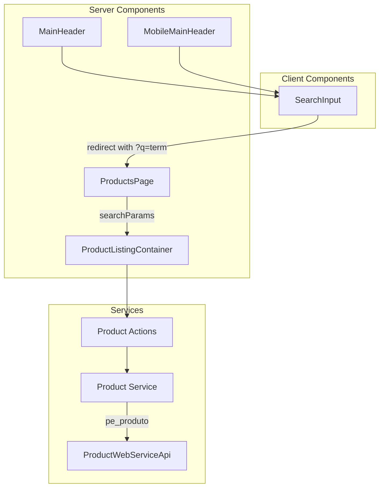

# Design Document - Product Search

## Overview

Este documento descreve o design técnico para implementar a funcionalidade de pesquisa de produtos no e-commerce. A solução envolve a criação de um componente de busca reutilizável (Client Component), modificação da página de produtos para aceitar query parameters, e integração com a API existente através do parâmetro `pe_produto`.

## Architecture

A arquitetura segue o padrão Next.js App Router com Server Components e Client Components:



### Data Flow

1. Usuário digita termo no `SearchInput` (Client Component)
2. Ao submeter, `SearchInput` redireciona para `/products?q=termo`
3. `ProductsPage` recebe `searchParams` e passa para `ProductListingContainer`
4. `ProductListingContainer` chama `fetchProductsAction` com o termo de busca
5. A action chama `getProducts` no service com o parâmetro `searchTerm`
6. O service chama `ProductWebServiceApi.findProducts` com `pe_produto`
7. Resultados são exibidos na página

## Components and Interfaces

### SearchInput Component (New - Client Component)

```typescript
// src/components/search/SearchInput.tsx
"use client";

interface SearchInputProps {
  placeholder?: string;
  className?: string;
}

export function SearchInput({ 
  placeholder = "O que você procura?",
  className 
}: SearchInputProps): JSX.Element;
```

**Responsabilidades:**
- Gerenciar estado do input de busca
- Validar termo de busca (não vazio, não apenas whitespace)
- Redirecionar para `/products?q=termo` ao submeter
- Suportar submissão via Enter e clique no botão

### Updated Interfaces

#### fetchProductsAction (Updated)

```typescript
// src/app/actions/product.ts
export async function fetchProductsAction(
  params: {
    taxonomyId?: number;
    brandId?: number;
    limit?: number;
    page?: number;
    searchTerm?: string; // NEW: termo de busca
  } = {},
): Promise<RawProduct[]>;
```

#### getProducts (Updated)

```typescript
// src/services/product.ts
export async function getProducts(
  params: {
    taxonomyId?: number;
    brandId?: number;
    limit?: number;
    page?: number;
    searchTerm?: string; // NEW: termo de busca
  } = {},
): Promise<UIProduct[]>;
```

#### ProductsPage (Updated)

```typescript
// src/app/(catalog)/products/page.tsx
interface ProductsPageProps {
  searchParams: Promise<{ q?: string }>;
}

export default async function ProductsPage({ 
  searchParams 
}: ProductsPageProps): Promise<JSX.Element>;
```

#### ProductListingContainer (Updated)

```typescript
// src/app/(catalog)/products/_components/ProductListingContainer.tsx
interface ProductListingContainerProps {
  searchTerm?: string;
}

export async function ProductListingContainer({ 
  searchTerm 
}: ProductListingContainerProps): Promise<JSX.Element>;
```

## Data Models

### Search Query Parameter

| Parameter | Type | Description |
|-----------|------|-------------|
| `q` | `string` | Termo de busca codificado na URL |

### API Request Parameter

| Parameter | Type | Description |
|-----------|------|-------------|
| `pe_produto` | `string` | Termo de busca enviado para a API (máx. 300 caracteres) |

A API realiza busca parcial (LIKE) nos campos:
- `PRODUTO` (nome do produto)
- `DESCRICAO_TAB` (descrição da tabela)
- `REF` (referência)


## Correctness Properties

*A property is a characteristic or behavior that should hold true across all valid executions of a system-essentially, a formal statement about what the system should do. Properties serve as the bridge between human-readable specifications and machine-verifiable correctness guarantees.*

### Property Reflection

After analyzing the acceptance criteria, I identified the following redundancies:
- Requirements 3.1 and 3.2 are covered by 1.1 since both headers use the same SearchInput component
- Requirements 1.2 and 1.3 can be combined into a single "invalid input rejection" property
- Requirements 2.2 and 4.1 both test that the search term is correctly passed through the system

Final properties after consolidation:

### Property 1: Valid search term navigation
*For any* non-empty, non-whitespace search term, submitting the search form SHALL result in navigation to `/products?q={encodedTerm}` where `encodedTerm` is the URL-encoded version of the search term.
**Validates: Requirements 1.1, 1.4**

### Property 2: Invalid search term rejection
*For any* string that is empty or composed entirely of whitespace characters, submitting the search form SHALL NOT trigger navigation and the form state SHALL remain unchanged.
**Validates: Requirements 1.2, 1.3**

### Property 3: Search term API propagation
*For any* search query parameter `q` received by the products page, the API call SHALL include `pe_produto` set to the decoded value of `q`.
**Validates: Requirements 2.1**

### Property 4: Search results display consistency
*For any* set of products returned by the API for a search term, the product listing SHALL display exactly those products (no more, no less).
**Validates: Requirements 2.2**

### Property 5: Search term display in title
*For any* search query parameter `q` received by the products page, the page title section SHALL contain the decoded and sanitized search term.
**Validates: Requirements 4.1, 4.2**

## Error Handling

| Scenario | Handling |
|----------|----------|
| Empty search term | Prevent form submission, no navigation |
| Whitespace-only search term | Trim and treat as empty, prevent submission |
| API error during search | Display error message, log error |
| No products found | Display "Nenhum produto encontrado" message |
| Invalid URL encoding | Decode gracefully, fallback to empty string |

## Testing Strategy

### Unit Testing

Unit tests will cover:
- `SearchInput` component: form submission, validation, navigation
- URL encoding/decoding of search terms
- Integration between page and container components

### Property-Based Testing

The project will use **fast-check** as the property-based testing library for TypeScript/JavaScript.

Each property-based test MUST:
- Run a minimum of 100 iterations
- Be tagged with a comment referencing the correctness property: `**Feature: product-search, Property {number}: {property_text}**`
- Be implemented as a SINGLE property-based test per correctness property

**Property Tests to Implement:**

1. **Property 1 Test**: Generate random valid search terms (non-empty, non-whitespace strings) and verify navigation URL is correct
2. **Property 2 Test**: Generate random whitespace-only strings and empty strings, verify no navigation occurs
3. **Property 3 Test**: Generate random search terms, verify API is called with correct `pe_produto` parameter
4. **Property 4 Test**: Generate random product arrays, verify all are displayed in the listing
5. **Property 5 Test**: Generate random search terms including special characters, verify they appear sanitized in the title
