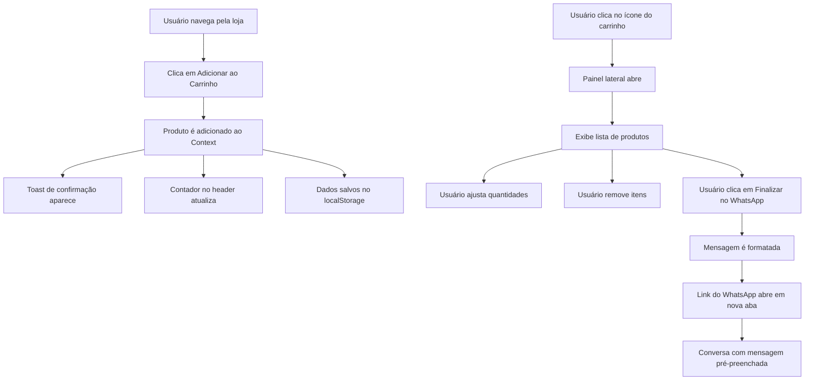

# Implementação Completa do Sistema de Carrinho de Compras

## 📋 Visão Geral do Projeto

Este documento detalha a implementação completa de um sistema de carrinho de compras para uma aplicação Next.js 16 com integração ao WhatsApp para finalização de pedidos.

---

## 🎯 Objetivos Principais

### 1. Implementar o Sistema de Gerenciamento de Estado do Carrinho
- Criar um **Context API** ou **Zustand Store** para gerenciar o estado global do carrinho
- Persistir dados do carrinho no **localStorage** para manter a sessão do usuário
- Sincronizar contador de itens em todos os componentes que exibem o carrinho

### 2. Implementar Painel Lateral do Carrinho (Cart Sidebar)
- Criar um **Sheet/Drawer** lateral direito responsivo
- Exibir lista completa de produtos adicionados com:
  - Imagem do produto
  - Nome do produto
  - Preço unitário
  - Quantidade (com controles +/-)
  - Subtotal por item
  - Botão para remover item
- Exibir resumo do pedido:
  - Subtotal de todos os itens
  - Total geral
  - Botão para finalizar pedido via WhatsApp tel: 5516997275438

### 3. Implementar Funcionalidade dos Botões "Adicionar ao Carrinho"
- Ativar o botão `AddToCartButton` existente em todos os cards de produtos
- Implementar feedback visual ao adicionar produto:
  - Animação no botão
  - Toast/notificação de sucesso
  - Atualização do contador no header
- Suportar adição de produtos em todas as rotas:
  - `/` (Home)
  - `/products` (Lista de Produtos)
  - `/category/[...slug]` (Página de Categoria)
  - `/product/[...slug]` (Página de Detalhes do Produto)

### 4. Implementar Integração com WhatsApp
- Formatar mensagem estruturada com:
  - Lista completa de produtos (nome, quantidade, preço)
  - Total do pedido
  - Link para abrir conversa no WhatsApp com a mensagem pré-preenchida
- Usar o número de WhatsApp configurado no ambiente (`.env`)

---

## 📂 Estrutura de Arquivos a Criar/Modificar

### Novos Arquivos

```
src/
├── contexts/
│   └── CartContext.tsx                    # Context API para gerenciamento do carrinho
│
├── hooks/
│   └── useCart.tsx                        # Hook personalizado para usar o CartContext
│
├── components/
│   └── cart/
│       ├── CartSidebar.tsx                # Painel lateral do carrinho (Client Component)
│       ├── CartItem.tsx                   # Item individual do carrinho
│       ├── CartSummary.tsx                # Resumo do pedido
│       └── WhatsAppCheckoutButton.tsx     # Botão de finalização via WhatsApp
│
├── lib/
│   └── whatsapp.ts                        # Utilitário para formatar mensagem do WhatsApp
│
└── types/
    └── cart.ts                            # Tipos TypeScript do carrinho
```

### Arquivos a Modificar

```
src/
├── app/
│   ├── layout.tsx                                              # Adicionar CartProvider
│   └── (home)/_components/
│       ├── header/components/UserActions.tsx                   # Integrar com useCart
│       └── footer/MobileBottomMenu.tsx                         # Integrar com useCart
│
└── components/
    └── product/actions/AddToCartButton.tsx                     # Implementar lógica real
```

---

## 🔧 Especificações Técnicas Detalhadas

### 1. Estrutura de Dados do Carrinho

#### Interface TypeScript (`src/types/cart.ts`)

```typescript
export interface CartItem {
  id: string;                    // ID único do produto
  productId: string;             // ID do produto no sistema
  name: string;                  // Nome do produto
  price: number;                 // Preço unitário
  quantity: number;              // Quantidade no carrinho
  image: string;                 // URL da imagem
  category: string;              // Categoria do produto
  discount?: number;             // Desconto percentual (opcional)
}

export type PaymentMethod = 'PIX' | 'Cartão' | 'Dinheiro';

export interface CartState {
  items: CartItem[];             // Lista de itens no carrinho
  totalItems: number;            // Total de itens (soma das quantidades)
  totalPrice: number;            // Preço total do carrinho
  paymentMethod: PaymentMethod;  // Forma de pagamento selecionada
}

export interface CartActions {
  addItem: (item: Omit<CartItem, 'quantity'>) => void;
  removeItem: (productId: string) => void;
  updateQuantity: (productId: string, quantity: number) => void;
  setPaymentMethod: (method: PaymentMethod) => void;
  clearCart: () => void;
  isOpen: boolean;
  openCart: () => void;
  closeCart: () => void;
}
```

### 2. Context API do Carrinho (`src/contexts/CartContext.tsx`)

**Requisitos:**
- Usar `useContext` + `useReducer` para gerenciamento de estado
- Implementar persistência automática no `localStorage`
- Calcular automaticamente `totalItems` e `totalPrice`
- Gerenciar estado de abertura/fechamento do painel lateral
- Gerenciar forma de pagamento selecionada (padrão: 'PIX')

**Funcionalidades obrigatórias:**
- `addItem()`: Adicionar produto ou incrementar quantidade se já existir
- `removeItem()`: Remover produto completamente do carrinho
- `updateQuantity()`: Atualizar quantidade específica de um produto
- `setPaymentMethod()`: Atualizar forma de pagamento selecionada
- `clearCart()`: Limpar todos os itens do carrinho
- `openCart()` / `closeCart()`: Controlar visibilidade do painel

**Exemplo de comportamento esperado:**
```typescript
// Se produto JÁ está no carrinho
addItem(product) → incrementa quantity +1

// Se produto NÃO está no carrinho
addItem(product) → adiciona com quantity = 1
```

### 3. Hook Personalizado (`src/hooks/useCart.tsx`)

**Objetivo:** Simplificar acesso ao CartContext

```typescript
export function useCart() {
  const context = useContext(CartContext);
  
  if (!context) {
    throw new Error('useCart must be used within CartProvider');
  }
  
  return context;
}
```

### 4. Painel Lateral do Carrinho (`src/components/cart/CartSidebar.tsx`)

**Tipo de Componente:** Client Component (`"use client"`)

**Biblioteca sugerida:** `shadcn/ui Sheet` (já presente no projeto)

**Layout:**
```
┌─────────────────────────────────┐
│ [X] Meu Carrinho         (3)    │  ← Header
├─────────────────────────────────┤
│                                 │
│  [Produto 1]  [-] 2 [+]  R$ 50  │  ← CartItem
│  [Produto 2]  [-] 1 [+]  R$ 30  │
│  [Produto 3]  [-] 3 [+]  R$ 90  │
│                                 │
├─────────────────────────────────┤
│  Forma de Pagamento             │  ← PaymentMethodSelector
│  [v PIX            ▼]           │
├─────────────────────────────────┤
│  Subtotal:           R$ 170,00  │  ← CartSummary
│  Total:              R$ 170,00  │
│                                 │
│  [📱 Finalizar no WhatsApp]     │  ← WhatsAppCheckoutButton
└─────────────────────────────────┘
```

**Funcionalidades:**
- Abrir/fechar via props `isOpen` e `onClose` do `useCart`
- Exibir mensagem "Carrinho vazio" quando não houver itens
- Scroll automático se lista de produtos for muito longa
- Animações suaves de entrada/saída

### 5. Item do Carrinho (`src/components/cart/CartItem.tsx`)

**Props:**
```typescript
interface CartItemProps {
  item: CartItem;
}
```

**Elementos:**
- Imagem do produto (60x60px)
- Nome do produto (truncado se necessário)
- Preço unitário
- Controles de quantidade:
  - Botão `-` (desabilitar se quantity === 1)
  - Input numérico com quantity
  - Botão `+`
- Subtotal calculado (price × quantity)
- Botão de remover (ícone de lixeira)

**Comportamento:**
- Ao clicar `-`: `updateQuantity(id, quantity - 1)` ou `removeItem(id)` se quantity === 1
- Ao clicar `+`: `updateQuantity(id, quantity + 1)`
- Ao clicar remover: `removeItem(id)` com confirmação opcional

### 6. Resumo do Carrinho (`src/components/cart/CartSummary.tsx`)

**Cálculos:**
```typescript
subtotal = items.reduce((sum, item) => sum + (item.price * item.quantity), 0)
total = subtotal // (futuro: pode incluir frete, cupons, etc)
```

**Formatação:**
```typescript
new Intl.NumberFormat('pt-BR', {
  style: 'currency',
  currency: 'BRL'
}).format(total)
```

### 6.1. Seletor de Forma de Pagamento (`src/components/cart/PaymentMethodSelector.tsx`)

**Tipo de Componente:** Client Component (`"use client"`)

**Biblioteca sugerida:** `shadcn/ui Select` (já presente no projeto)

**Props:**
```typescript
interface PaymentMethodSelectorProps {
  value: PaymentMethod;
  onChange: (method: PaymentMethod) => void;
}
```

**Implementação:**
```typescript
"use client";

import {
  Select,
  SelectContent,
  SelectItem,
  SelectTrigger,
  SelectValue,
} from "@/components/ui/select";
import { PaymentMethod } from "@/types/cart";

const paymentMethods: { value: PaymentMethod; label: string; icon: string }[] = [
  { value: "PIX", label: "PIX", icon: "💳" },
  { value: "Cartão", label: "Cartão", icon: "💳" },
  { value: "Dinheiro", label: "Dinheiro", icon: "💵" },
];

export function PaymentMethodSelector({ value, onChange }: PaymentMethodSelectorProps) {
  return (
    <div className="space-y-2">
      <label className="text-sm font-medium text-foreground">
        Forma de Pagamento
      </label>
      <Select value={value} onValueChange={onChange}>
        <SelectTrigger className="w-full">
          <SelectValue placeholder="Selecione a forma de pagamento" />
        </SelectTrigger>
        <SelectContent>
          {paymentMethods.map((method) => (
            <SelectItem key={method.value} value={method.value}>
              <span className="flex items-center gap-2">
                <span>{method.icon}</span>
                <span>{method.label}</span>
              </span>
            </SelectItem>
          ))}
        </SelectContent>
      </Select>
    </div>
  );
}
```

**Uso no CartSidebar:**
```typescript
import { PaymentMethodSelector } from "./PaymentMethodSelector";
import { useCart } from "@/hooks/useCart";

export function CartSidebar() {
  const { paymentMethod, setPaymentMethod } = useCart();

  return (
    <div>
      {/* ... outros componentes ... */}
      <PaymentMethodSelector 
        value={paymentMethod} 
        onChange={setPaymentMethod} 
      />
      {/* ... CartSummary e botão WhatsApp ... */}
    </div>
  );
}
```

**Posicionamento no layout:**
- Deve aparecer APÓS a lista de produtos
- ANTES do resumo de totais (CartSummary)
- Estilo consistente com o design do painel

### 7. Botão de Finalização via WhatsApp (`src/components/cart/WhatsAppCheckoutButton.tsx`)

**Variável de Ambiente (.env):**
```env
NEXT_PUBLIC_WHATSAPP_NUMBER=5511999999999
```

**Formatação da Mensagem (`src/lib/whatsapp.ts`):**
```typescript
export function formatWhatsAppMessage(items: CartItem[], total: number): string {
  const itemsList = items.map((item, index) => 
    `${index + 1}. ${item.name}\n` +
    `   Quantidade: ${item.quantity}\n` +
    `   Preço: ${formatCurrency(item.price)}\n` +
    `   Subtotal: ${formatCurrency(item.price * item.quantity)}`
  ).join('\n\n');

  return encodeURIComponent(
    `🛒 *Novo Pedido*\n\n` +
    `${itemsList}\n\n` +
    `━━━━━━━━━━━━\n` +
    `*Total: ${formatCurrency(total)}*\n\n` +
    `Gostaria de finalizar este pedido.`
  );
}

export function getWhatsAppLink(message: string): string {
  const phone = process.env.NEXT_PUBLIC_WHATSAPP_NUMBER;
  return `https://wa.me/${phone}?text=${message}`;
}
```

exemplo de mensagem para o whatsa
"""
Olá! Gostaria de realizar um pedido. Itens: 
1. FRONTAL IPHONE 11 FHD - ORI - 1x R$ 95,00 = R$ 95,00 
2. FRONTAL IPHONE 11 ORI - 1x R$ 86,00 = R$ 86,00 
3. FRONTAL IPHONE 6 PLUS BRANCO - 1x R$ 50,00 = R$ 50,00 

Subtotal: R$ 231,00 
Frete: R$ 15,00 
Total: R$ 246,00 

Forma de pagamento: Dinheiro

"""

**Comportamento do Botão:**
1. Ao clicar: abrir link do WhatsApp em nova aba
2. Opcional: limpar carrinho após envio
3. Opcional: fechar painel do carrinho

### 8. Modificação do AddToCartButton

**Arquivo:** `src/components/product/actions/AddToCartButton.tsx`

**Alterações necessárias:**

```typescript
"use client";

import { ShoppingCart } from "lucide-react";
import { useState } from "react";
import { useCart } from "@/hooks/useCart";
import { toast } from "sonner"; // ou react-hot-toast

export function AddToCartButton({ productId, productName, price }: Props) {
  const { addItem, openCart } = useCart();
  const [isAdding, setIsAdding] = useState(false);

  const handleAddToCart = async () => {
    setIsAdding(true);
    
    // Adicionar ao carrinho
    addItem({
      id: generateUniqueId(), // ou usar productId
      productId,
      name: productName,
      price,
      image: productImage, // precisa ser passado como prop
      category: productCategory, // precisa ser passado como prop
    });

    // Feedback visual
    toast.success(`${productName} adicionado ao carrinho!`);
    
    // Opcional: abrir carrinho automaticamente
    // openCart();
    
    setIsAdding(false);
  };

  return (
    <button onClick={handleAddToCart} disabled={isAdding}>
      <ShoppingCart /> {isAdding ? "Adicionando..." : "Adicionar"}
    </button>
  );
}
```

**Props adicionais necessárias:**
- `image: string`
- `category: string`

### 9. Modificação do UserActions (Desktop)

**Arquivo:** `src/app/(home)/_components/header/components/UserActions.tsx`

**Alterações:**

```typescript
"use client";

import { ShoppingCart } from "lucide-react";
import { useCart } from "@/hooks/useCart";

export function UserActions() {
  const { totalItems, openCart } = useCart();

  return (
    <div>
      {/* ... outros botões ... */}
      
      <button onClick={openCart}>
        <ShoppingCart />
        {totalItems > 0 && (
          <span className="badge">{totalItems > 99 ? "99+" : totalItems}</span>
        )}
        <span>Carrinho</span>
      </button>
    </div>
  );
}
```

**Remover:**
- `useState` manual do `cartCount`
- `useEffect` que lê do localStorage
- Link `<a href="/cart">` (substituir por `<button onClick={openCart}>`)

### 10. Modificação do MobileBottomMenu

**Arquivo:** `src/app/(home)/_components/footer/MobileBottomMenu.tsx`

**Alterações:**

```typescript
"use client"; // Adicionar diretiva

import { useCart } from "@/hooks/useCart";

export function MobileBottomMenu() {
  const { totalItems, openCart } = useCart();

  const menuItems = [
    // ... outros itens ...
    {
      id: "carrinho",
      label: "Carrinho",
      icon: ShoppingCart,
      onClick: openCart, // Adicionar
      badge: totalItems,  // Usar valor dinâmico
    },
  ];

  return (
    <nav>
      {menuItems.map((item) => (
        <button key={item.id} onClick={item.onClick}>
          {/* ... renderizar item ... */}
        </button>
      ))}
    </nav>
  );
}
```

**Mudanças:**
- Converter de Server Component para Client Component
- Adicionar hook `useCart`
- Trocar `<Link>` do carrinho por `<button>` com `onClick={openCart}`

### 11. Modificação do Layout Principal

**Arquivo:** `src/app/layout.tsx`

**Adicionar:**

```typescript
import { CartProvider } from "@/contexts/CartContext";
import { CartSidebar } from "@/components/cart/CartSidebar";

export default function RootLayout({ children }) {
  return (
    <html>
      <body>
        <CartProvider>
          {children}
          <CartSidebar />
        </CartProvider>
      </body>
    </html>
  );
}
```

**Observação:** O `<CartSidebar />` deve ser incluído globalmente para estar acessível em todas as páginas.

---

## 🎨 Requisitos de UX/UI

### Design do Painel Lateral
- **Largura:** 400px em desktop, 100% em mobile
- **Animação:** Slide-in da direita para esquerda
- **Backdrop:** Overlay escuro com 50% de opacidade
- **Responsividade:** Full-screen em dispositivos móveis

### Feedback Visual
- **Toast/Notificação:** Exibir ao adicionar produto
- **Animação no botão:** Pulse ou scale ao adicionar
- **Loading state:** Spinner ou texto "Adicionando..."
- **Badge no ícone:** Círculo vermelho/primary com número de itens

### Estados Vazios
- Quando carrinho está vazio:
  - Ícone de carrinho vazio
  - Texto: "Seu carrinho está vazio"
  - Botão: "Continuar comprando" (fecha o painel)

---

## ✅ Checklist de Implementação

### Fase 1: Fundação
- [ ] Criar tipos TypeScript (`src/types/cart.ts`)
- [ ] Implementar `CartContext` com persistência no localStorage
- [ ] Criar hook `useCart`
- [ ] Adicionar `CartProvider` no layout principal

### Fase 2: Interface do Carrinho
- [ ] Criar componente `CartSidebar` com shadcn/ui Sheet
- [ ] Criar componente `CartItem` com controles de quantidade
- [ ] Criar componente `CartSummary` com cálculos de totais
- [ ] Implementar estado vazio do carrinho

### Fase 3: Integração com Produtos
- [ ] Atualizar `AddToCartButton` para usar `useCart`
- [ ] Adicionar props de `image` e `category` ao botão
- [ ] Implementar toast de confirmação
- [ ] Testar adição em todas as rotas (Home, Products, Category, Product Detail)

### Fase 4: Integração WhatsApp
- [ ] Criar função `formatWhatsAppMessage` em `src/lib/whatsapp.ts`
- [ ] Criar `WhatsAppCheckoutButton` component
- [ ] Adicionar variável `NEXT_PUBLIC_WHATSAPP_NUMBER` no `.env`
- [ ] Testar geração de link e abertura no WhatsApp

### Fase 5: Header e Footer
- [ ] Atualizar `UserActions` (desktop) para usar `useCart`
- [ ] Converter `MobileBottomMenu` para Client Component
- [ ] Integrar contador dinâmico em ambos os componentes
- [ ] Testar abertura do painel por ambos os botões

### Fase 6: Testes e Refinamentos
- [ ] Testar persistência no localStorage
- [ ] Testar responsividade em mobile e desktop
- [ ] Validar formatação de preços (R$)
- [ ] Validar formatação da mensagem do WhatsApp
- [ ] Testar remoção e atualização de quantidade
- [ ] Verificar performance (evitar re-renders desnecessários)

---

## 🚀 Fluxo Completo do Usuário



---

## 📝 Notas Importantes

### Performance
- Use `memo` em `CartItem` para evitar re-renders desnecessários
- Considere debounce nos controles de quantidade
- Otimize re-renderizações do Context usando `useMemo`

### Segurança
- Valide sempre a quantidade (mínimo: 1, máximo: definir limite)
- Sanitize dados antes de salvar no localStorage
- Valide número de WhatsApp no formato correto

### Acessibilidade
- Adicione `aria-label` em todos os botões de ícone
- Use `role="dialog"` no painel lateral
- Garanta navegação por teclado (Tab, Esc para fechar)

### SEO
- Como são Client Components, não impactarão diretamente o SEO
- Mantenha a maior parte do conteúdo em Server Components

### Extensibilidade Futura
- Estrutura preparada para adicionar:
  - Cupons de desconto
  - Cálculo de frete
  - Múltiplos métodos de pagamento
  - Integração com API backend
  - Autenticação de usuário

---

## 🔗 Dependências Necessárias

Certifique-se de que as seguintes bibliotecas estão instaladas:

```json
{
  "dependencies": {
    "sonner": "^latest",           // ou "react-hot-toast"
    "@radix-ui/react-dialog": "^latest",  // (via shadcn/ui Sheet)
    "zustand": "^latest"            // (alternativa ao Context API)
  }
}
```

Se usar `toast`, adicionar no layout:
```tsx
import { Toaster } from 'sonner';

<Toaster position="top-right" />
```

---

## 📞 Exemplo de Mensagem WhatsApp Formatada

```
🛒 *Novo Pedido*

1. Perfume Versace Eros EDT 100ml
   Quantidade: 2
   Preço: R$ 299,90
   Subtotal: R$ 599,80

2. Hidratante Neutrogena 200ml
   Quantidade: 1
   Preço: R$ 45,90
   Subtotal: R$ 45,90

━━━━━━━━━━━━
*Total: R$ 645,70*

Gostaria de finalizar este pedido.
```

---

## 🎓 Boas Práticas do Next.js 16

- **Server Components por padrão:** Mantenha o máximo de código no servidor
- **Client Components apenas quando necessário:** Use `"use client"` apenas em componentes interativos
- **Islands Architecture:** `AddToCartButton` e `WishlistButton` como ilhas dentro de Server Components
- **Caching:** Server Components cacheaveis, Client Components isolados
- **Suspense Boundaries:** Considere adicionar Suspense ao redor de componentes assíncronos

---

## 📊 Métricas de Sucesso

Após a implementação, validar:
- [ ] Produtos são adicionados corretamente ao carrinho
- [ ] Contador de itens está sincronizado em todos os locais
- [ ] Persistência funciona após recarregar a página
- [ ] Painel lateral abre/fecha suavemente
- [ ] Controles de quantidade funcionam corretamente
- [ ] Remoção de itens funciona
- [ ] Link do WhatsApp é gerado corretamente
- [ ] Mensagem do WhatsApp está formatada e legível
- [ ] Responsividade em mobile e desktop
- [ ] Sem erros no console do navegador

---

**Data de criação:** 2025-12-02  
**Versão:** 2.0 (Otimizada)  
**Projeto:** web-app-e-commerce-v4
